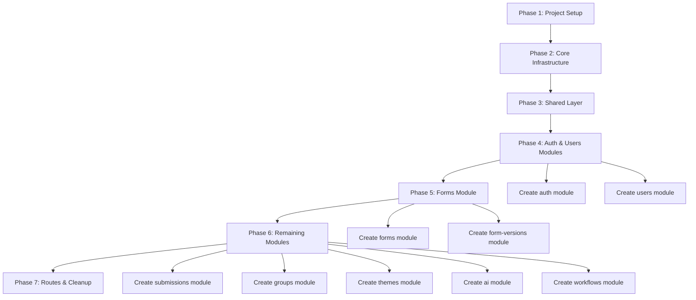

# Backend Refactor Plan

## Overview

This document outlines a comprehensive refactoring plan to restructure the backend API from its current **flat file organization** to a **domain-driven, module-based architecture** aligned with the [CODING_GUIDE.md](../CODING_GUIDE.md) standards.

---

## 1. Current State Analysis

### 1.1 Current Directory Structure

```
backend/src/
├── app.js                    # Express app (middleware, routes) - ISSUE: mixed concerns
├── server.js                 # Entry point - ISSUE: async/await style inconsistent
├── config/
│   ├── firebase.js
│   └── swagger.js
├── controllers/              # ISSUE: flat structure, no module encapsulation
│   ├── aiController.js
│   ├── authController.js
│   ├── formController.js
│   ├── formVersionController.js
│   ├── groupController.js
│   ├── submissionController.js
│   ├── themeTemplateController.js
│   ├── userController.js
│   └── workflowController.js
├── db/
│   └── db.js
├── middleware/
│   ├── auth.js
│   └── errorHandler.js
├── models/                   # ISSUE: flat structure, Mongoose mixed with business logic
│   ├── ComponentGroup.js
│   ├── Form.js
│   ├── FormVersion.js
│   ├── Submission.js
│   ├── ThemeTemplate.js
│   └── User.js
├── registry/
│   └── components.js
├── routes/                   # ISSUE: flat structure, routes not co-located with modules
│   ├── aiRoutes.js
│   ├── authRoutes.js
│   ├── formRoutes.js
│   ├── formVersionRoutes.js
│   ├── groupRoutes.js
│   ├── submissionRoutes.js
│   ├── themeTemplateRoutes.js
│   ├── userRoutes.js
│   └── workflowRoutes.js
├── services/                 # ISSUE: flat structure, some services have subdirectories
│   ├── aiService.js
│   ├── authService.js
│   ├── formService.js
│   ├── formVersionService.js
│   ├── groupService.js
│   ├── logicEngine.js
│   ├── submissionService.js
│   ├── themeTemplateService.js
│   ├── userService.js
│   ├── workflowEngine.js
│   ├── workflowService.js
│   └── logicEngine/          # Subdirectory for logic engine components
│       ├── conditionTree.js
│       ├── formulaParser.js
│       ├── helpers.js
│       └── normalizer.js
└── utils/
    ├── aiForm.schema.js
    ├── conditionEvaluator.js
    ├── formPermissions.js
    ├── schemaPromptBuilder.js
    └── validators.js
```

### 1.2 Issues Identified

| Category | Issue | Severity |
|----------|-------|----------|
| **Structure** | Flat file organization - no module encapsulation | High |
| **Structure** | Controllers, services, routes not co-located per domain | High |
| **Structure** | Models mixed at root level without domain grouping | High |
| **Naming** | `.js` files instead of `.ts` (TypeScript in devDependencies but not used) | Medium |
| **Naming** | Mixed naming conventions (some camelCase, some PascalCase) | Medium |
| **Architecture** | Database queries in services (should have repository layer) | High |
| **Architecture** | Business logic in controllers (should delegate to services) | Medium |
| **Architecture** | No Zod validation schemas (Zod is installed but not used) | High |
| **Architecture** | No TypeScript types/interfaces defined | High |
| **Configuration** | Routes registered in `app.js` instead of centralized `routes/index.js` | Medium |
| **Configuration** | Firebase config mixed with app config | Low |

---

## 2. Target Architecture

Based on [Section 3: Backend API Structure](../CODING_GUIDE.md#3-backend-api-structure) of CODING_GUIDE.md:

```
backend/src/
├── server.ts                 # Entry point (bootstraps Express, starts HTTP server)
├── app.ts                    # Express app (middleware, routes) - renamed from app.js
├── config/
│   ├── firebase.ts
│   ├── swagger.ts
│   └── index.ts              # Centralized config exports
├── database/
│   ├── connection.ts         # MongoDB connection (renamed from db/db.js)
│   └── index.ts
├── modules/                  # Domain-driven modules
│   ├── auth/
│   │   ├── auth.controller.ts
│   │   ├── auth.service.ts
│   │   ├── auth.repository.ts
│   │   ├── auth.routes.ts
│   │   ├── auth.schema.ts
│   │   ├── auth.types.ts
│   │   └── index.ts
│   ├── forms/
│   │   ├── form.controller.ts
│   │   ├── form.service.ts
│   │   ├── form.repository.ts
│   │   ├── form.routes.ts
│   │   ├── form.schema.ts
│   │   ├── form.types.ts
│   │   └── index.ts
│   ├── form-versions/
│   │   ├── form-version.controller.ts
│   │   ├── form-version.service.ts
│   │   ├── form-version.repository.ts
│   │   ├── form-version.routes.ts
│   │   ├── form-version.schema.ts
│   │   ├── form-version.types.ts
│   │   └── index.ts
│   ├── submissions/
│   │   ├── submission.controller.ts
│   │   ├── submission.service.ts
│   │   ├── submission.repository.ts
│   │   ├── submission.routes.ts
│   │   ├── submission.schema.ts
│   │   ├── submission.types.ts
│   │   └── index.ts
│   ├── users/
│   │   ├── user.controller.ts
│   │   ├── user.service.ts
│   │   ├── user.repository.ts
│   │   ├── user.routes.ts
│   │   ├── user.schema.ts
│   │   ├── user.types.ts
│   │   └── index.ts
│   ├── groups/
│   │   ├── group.controller.ts
│   │   ├── group.service.ts
│   │   ├── group.repository.ts
│   │   ├── group.routes.ts
│   │   ├── group.schema.ts
│   │   ├── group.types.ts
│   │   └── index.ts
│   ├── themes/
│   │   ├── theme.controller.ts
│   │   ├── theme.service.ts
│   │   ├── theme.repository.ts
│   │   ├── theme.routes.ts
│   │   ├── theme.schema.ts
│   │   ├── theme.types.ts
│   │   └── index.ts
│   ├── ai/
│   │   ├── ai.controller.ts
│   │   ├── ai.service.ts
│   │   ├── ai.routes.ts
│   │   ├── ai.schema.ts
│   │   ├── ai.types.ts
│   │   └── index.ts
│   └── workflows/
│       ├── workflow.controller.ts
│       ├── workflow.service.ts
│       ├── workflow.repository.ts
│       ├── workflow.routes.ts
│       ├── workflow.schema.ts
│       ├── workflow.types.ts
│       └── index.ts
├── shared/                   # Cross-cutting concerns
│   ├── middleware/
│   │   ├── auth.middleware.ts
│   │   ├── error-handler.middleware.ts
│   │   └── index.ts
│   ├── utils/
│   │   ├── validators.ts
│   │   ├── form-permissions.ts
│   │   └── index.ts
│   └── types/
│       ├── express.d.ts
│       └── index.ts
├── routes/
│   └── index.ts              # Central route registration
└── utils/
    ├── logic-engine/
    │   ├── condition-tree.ts
    │   ├── formula-parser.ts
    │   ├── helpers.ts
    │   ├── normalizer.ts
    │   └── index.ts
    └── index.ts
```

---

## 3. Refactoring Tasks

### Phase 1: Project Setup

- [ ] Add TypeScript configuration (`tsconfig.json`)
- [ ] Update `package.json` scripts for TypeScript compilation
- [ ] Install required TypeScript types (`@types/express`, `@types/node`, `@types/mongoose`, etc.)
- [ ] Rename all `.js` files to `.ts`
- [ ] Update `package.json` main entry point

### Phase 2: Core Infrastructure

- [ ] Create `database/connection.ts` - MongoDB connection with proper typing
- [ ] Create `config/index.ts` - centralized config exports
- [ ] Create `shared/types/express.d.ts` - Express type augmentations
- [ ] Refactor `server.ts` - proper async/await, typed
- [ ] Refactor `app.ts` - middleware setup with types

### Phase 3: Shared Layer

- [ ] Create `shared/middleware/auth.middleware.ts` - typed JWT verification
- [ ] Create `shared/middleware/error-handler.middleware.ts` - typed error handler
- [ ] Create `shared/utils/validators.ts` - Zod validation helpers
- [ ] Create `shared/utils/form-permissions.ts` - typed permission checks
- [ ] Create `shared/utils/condition-evaluator.ts` - typed condition evaluation

### Phase 4: Module Migration (Auth → Users → Forms)

#### Auth Module
- [ ] Create `modules/auth/auth.types.ts` - `LoginRequest`, `AuthResponse` interfaces
- [ ] Create `modules/auth/auth.schema.ts` - Zod validation schemas
- [ ] Create `modules/auth/auth.repository.ts` - User database operations
- [ ] Create `modules/auth/auth.service.ts` - business logic (JWT, login)
- [ ] Create `modules/auth/auth.controller.ts` - HTTP handlers
- [ ] Create `modules/auth/auth.routes.ts` - Express Router
- [ ] Create `modules/auth/index.ts` - barrel export

#### Users Module
- [ ] Create `modules/users/user.types.ts`
- [ ] Create `modules/users/user.schema.ts`
- [ ] Create `modules/users/user.repository.ts`
- [ ] Create `modules/users/user.service.ts`
- [ ] Create `modules/users/user.controller.ts`
- [ ] Create `modules/users/user.routes.ts`
- [ ] Create `modules/users/index.ts`

#### Forms Module
- [ ] Create `modules/forms/form.types.ts`
- [ ] Create `modules/forms/form.schema.ts`
- [ ] Create `modules/forms/form.repository.ts`
- [ ] Create `modules/forms/form.service.ts`
- [ ] Create `modules/forms/form.controller.ts`
- [ ] Create `modules/forms/form.routes.ts`
- [ ] Create `modules/forms/index.ts`

### Phase 5: Module Migration (Remaining Modules)

- [ ] Form Versions Module - `modules/form-versions/`
- [ ] Submissions Module - `modules/submissions/`
- [ ] Groups Module - `modules/groups/`
- [ ] Themes Module - `modules/themes/`
- [ ] AI Module - `modules/ai/`
- [ ] Workflows Module - `modules/workflows/`

### Phase 6: Routes & Entry Point

- [ ] Create `routes/index.ts` - centralized route registration
- [ ] Update `app.ts` to use `routes/index.ts`
- [ ] Update `server.ts` imports

### Phase 7: Utilities & Cleanup

- [ ] Migrate `utils/logic-engine/` to `utils/logic-engine/`
- [ ] Update all imports across the codebase
- [ ] Remove old file structure
- [ ] Update README.md

---

## 4. Module File Structure Details

### 4.1 Required Files Per Module

Each module must contain:

| File | Purpose |
|------|---------|
| `*.types.ts` | TypeScript interfaces and types |
| `*.schema.ts` | Zod validation schemas |
| `*.repository.ts` | Database queries (Prisma/Mongoose abstraction) |
| `*.service.ts` | Business logic orchestration |
| `*.controller.ts` | HTTP request/response handling |
| `*.routes.ts` | Express Router definition |
| `index.ts` | Barrel export for public API |

### 4.2 Naming Conventions

| Type | Convention | Example |
|------|------------|---------|
| Folders | kebab-case | `form-versions/`, `auth/` |
| TypeScript files | camelCase | `auth.service.ts`, `form.controller.ts` |
| Types | PascalCase | `AuthTypes`, `FormResponse` |
| Schemas | camelCase + `.schema.ts` | `loginSchema`, `createFormSchema` |

---

## 5. Migration Sequence



---

## 6. Key Architectural Changes

### 6.1 Controller → Service → Repository Pattern

```
Request → Controller → Service → Repository → Database
                ↓
         Business Logic
         Validation
         Orchestration
```

**Controller**: Handles HTTP, delegates to service, no business logic
**Service**: Business logic, orchestrates repository calls
**Repository**: Database queries only, abstracted from business logic

### 6.2 Validation Flow

```
Request → Zod Schema Validation → Controller → Service → Repository
                ↓
         400 Bad Request (if invalid)
```

### 6.3 Type Safety

- All function parameters typed
- All return values typed
- Express Request/Response properly typed
- Mongoose documents typed with interfaces

---

## 7. Verification Checklist

After refactoring, verify:

- [ ] All routes still work correctly
- [ ] Authentication/authorization unchanged
- [ ] Database operations unchanged
- [ ] No circular dependencies introduced
- [ ] All imports resolved
- [ ] TypeScript compiles without errors
- [ ] API documentation (Swagger) still functional
- [ ] Tests pass (if any exist)

---

## 8. Rollback Plan

If issues arise:

1. Keep original `src/` as `src-legacy/`
2. Work in new `src/` structure
3. Test thoroughly before removing `src-legacy/`
4. If critical issue found, can temporarily point back to `src-legacy/`

---

## 9. Estimated Complexity

| Module | Complexity | Notes |
|--------|------------|-------|
| Auth | Medium | Small, well-isolated |
| Users | Medium | CRUD operations |
| Forms | High | Complex business logic, permissions |
| Form Versions | Medium | Versioning logic |
| Submissions | High | Workflow integration |
| Groups | Low | Simple CRUD |
| Themes | Low | Simple CRUD |
| AI | Medium | External API integration |
| Workflows | High | Complex state machine |

**Total Modules**: 9
**Estimated Phases**: 7

---

## 10. Next Steps

1. Review and approve this plan
2. Create `tsconfig.json` and project setup
3. Begin Phase 2: Core Infrastructure
4. Proceed module by module following the migration sequence
5. Test thoroughly after each phase